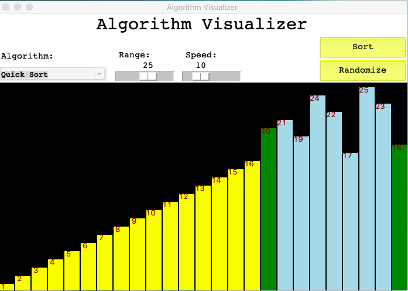

# Algorithm-Visualizer
This program visualizes how arrays get sorted in varius different algorithms. 

Can choose between Bubble Sort, Quick Sort, Selection Sort, Insertion sort and Merge sort.

Can specify range of data, speed and sorting method.

